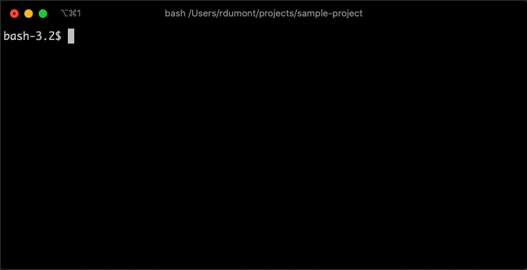

# Releaser
Release scripts for all of Escale's workflows

- [Releaser](#releaser)
  - [What it does](#what-it-does)
  - [Requirements](#requirements)
  - [Usage](#usage)
    - [Options](#options)
    - [Node.js shortcut](#nodejs-shortcut)
    - [Makefile shortcut](#makefile-shortcut)
  - [What it doesn't do](#what-it-doesnt-do)

## What it does



1. Prints the commits that are being considered for the version bump
2. Uses `conventional-recommended-bump` and `semver` to figure out the next version
3. Asks for your approval
4. Creates the new tag on the current commit
5. Pushes the tag

## Requirements

* [npx](https://www.npmjs.com/package/npx) - automatically bundled with [Node.js 8.2+](https://nodejs.org/en/)
* [Git](https://git-scm.com/)

## Usage

```sh
npx github:escaletech/releaser [--update-package-json] [--major-version <version>] [--gpg-sign]
```

### Options
* `--update-package-json`: pass this option if you want the releaser to update the version number in your `package.json` file. ⚠️ **Only use this option for releasing NPM packages, not applications.**
* `--major-version`: pass this option followed by a major version number to generate a tag specifically for a major version.
* `--gpg-sign`: pass this option to GPG sign your generated tags.

### Node.js shortcut

For calling with `npm run release` in Node.js projects:
```json
{
  "scripts": {
    "release": "npx github:escaletech/releaser"
  }
}
```

### Makefile shortcut

For calling with `make release`, in Go or Terraform projects:
```makefile
release:
	npx github:escaletech/releaser
```


## What it doesn't do

* It doesn't update any changelog file. To do so, we recommend using [`conventional-changelog`](https://github.com/conventional-changelog/conventional-changelog) or similar tool.
